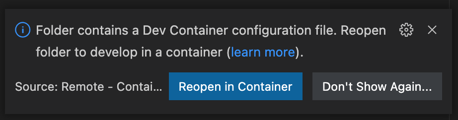

# Ledger Development Environment for VSCode

## What is this?

This is a [DevContainer](https://code.visualstudio.com/docs/remote/containers) environment for Visual Studio Code, allowing automatically installing [GNU Arm Embedded Toolchain](https://developer.arm.com/tools-and-software/open-source-software/developer-tools/gnu-toolchain/gnu-rm), [Clang](https://clang.llvm.org/), [Ledger Secure SDKs](https://github.com/LedgerHQ?q=secure-sdk) and [Speculos](https://github.com/LedgerHQ/speculos), and the necessary Visual Studio Code extensions to set up a Ledger app development environment with zero additional effort.

## How to use this?

Follow the [Getting Started](https://code.visualstudio.com/docs/remote/containers#_getting-started) instructions to configure your Visual Studio Code and Docker to use with DevContainers.

Place the `.devcontainer` directory in the root of your project, and the next time you load the project, Visual Studio Code will prompt to re-open the project in a container.

**Note**: building the container might take a few minutes until all dependencies have finished downloading.

## How does it work?

Visual Studio Code supports [Developing inside a Container](https://code.visualstudio.com/docs/remote/containers) - using a Docker image as a development environment. It automates the process of creating the container image, as well as installing additional required extensions into the editor.

Pressing **Reopen in Container** will perform the automated steps to launch the container, and set up the environment.

For more information and setup, read the official documentation: https://code.visualstudio.com/docs/remote/containers

## What's in the box?

It contains the following:

1. `/opt/nanos-secure-sdk/` - [Nano S Secure SDK](https://github.com/LedgerHQ/nanos-secure-sdk)
2. `/opt/nanox-secure-sdk/` - [Nano X Secure SDK](https://github.com/LedgerHQ/nanox-secure-sdk)
3. `/opt/nanoplus-secure-sdk/` - [Nano S Plus Secure SDK](https://github.com/LedgerHQ/nanosplus-secure-sdk)
4. `/opt/speculos/` - [Speculos](https://github.com/LedgerHQ/speculos) (Currently only headless mode is supported.)
5. `/opt/gcc-arm-none-eabi-10.3-2021.10/` - [GNU Arm Embedded Toolchain](https://developer.arm.com/tools-and-software/open-source-software/developer-tools/gnu-toolchain/gnu-rm)

The `devcontainer.json` has some additional configuration for VSCode, in particular, the required extensions that have to be installed, and the name of the remote user (must match the one in the `Dockerfile`), and `BOLOS_SDK` is set to `NANOS_SDK` by default, you can change it in the file.
